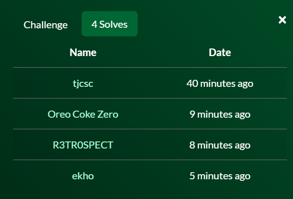
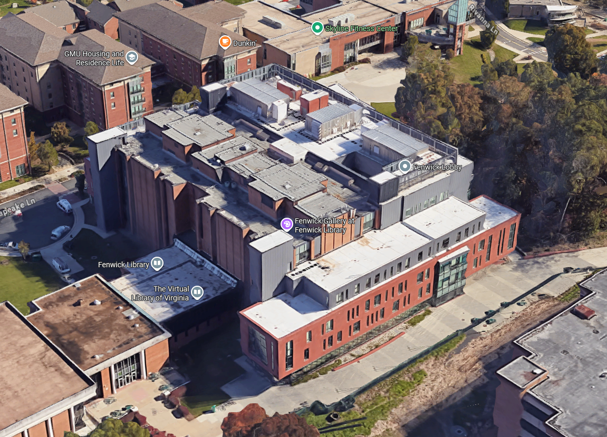
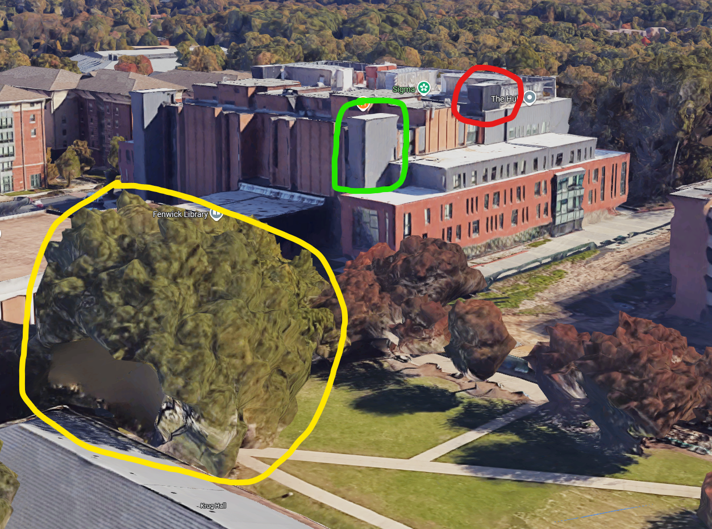
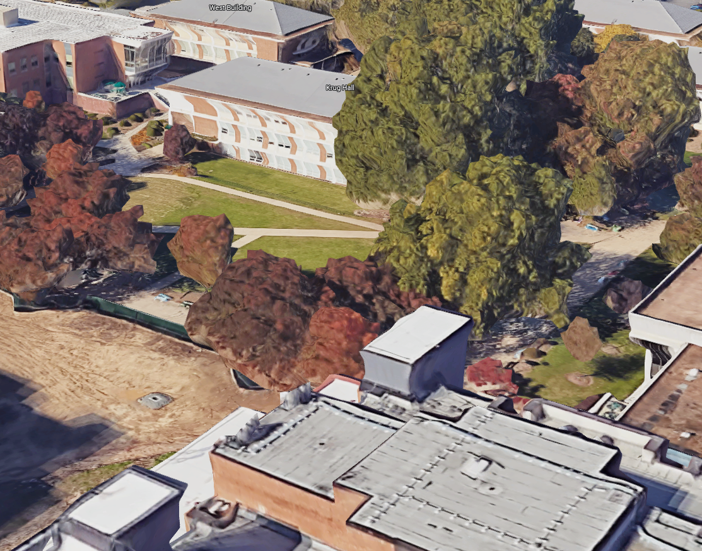

**PatriotCTF 2025**

I participated with my club team tjcsc in PatriotCTF 2025, and we got 54th overall!

**Challenge:** Where’s Legally Distinct Waldo Four

**Category:** OSINT

**Flag:** ``pctf{krug_hall}``

**Note:** I got first blood on the challenge 5 minutes into the CTF! Cool stuff.

So, here is the provided image:

Looks hard, but not really. There are still some things we can use to help us find where this was taken from. Since the past three challenges have all been places in the university campus, I assumed this one was as well. Let’s look around in Google Maps and see what we can find.

This building looks similar. Let’s try and match the angle:

The features match pretty well. So, let’s go back and see what building this image could have been taken from.

Krug Hall? Let’s try that… Done! ``pctf{krug_hall}``. First wave OSINT full cleared. That was pretty easy!

I full cleared the first wave OSINT in about 51 minutes after the competition started. They were very light and fun challenges.
