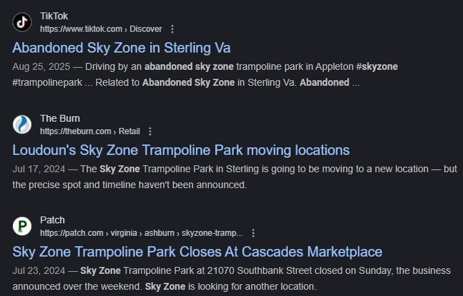
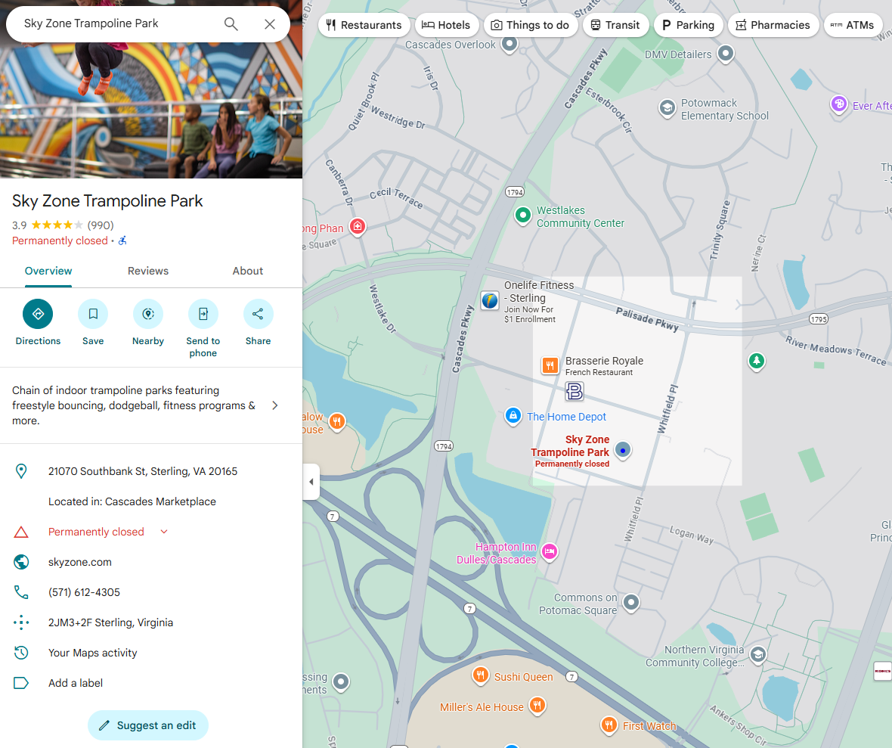
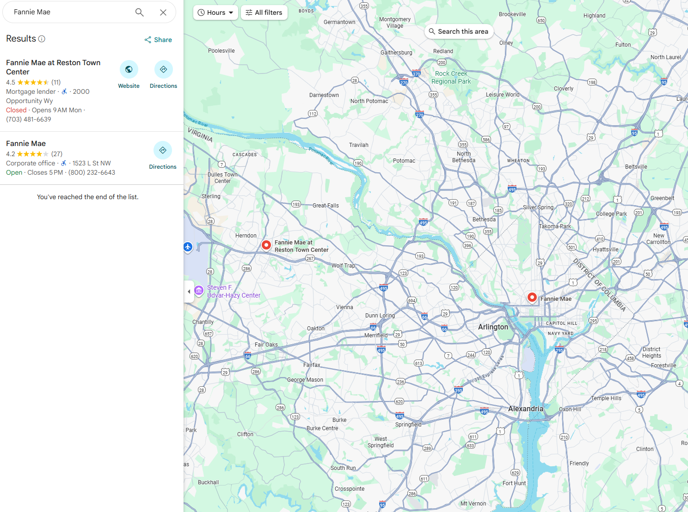
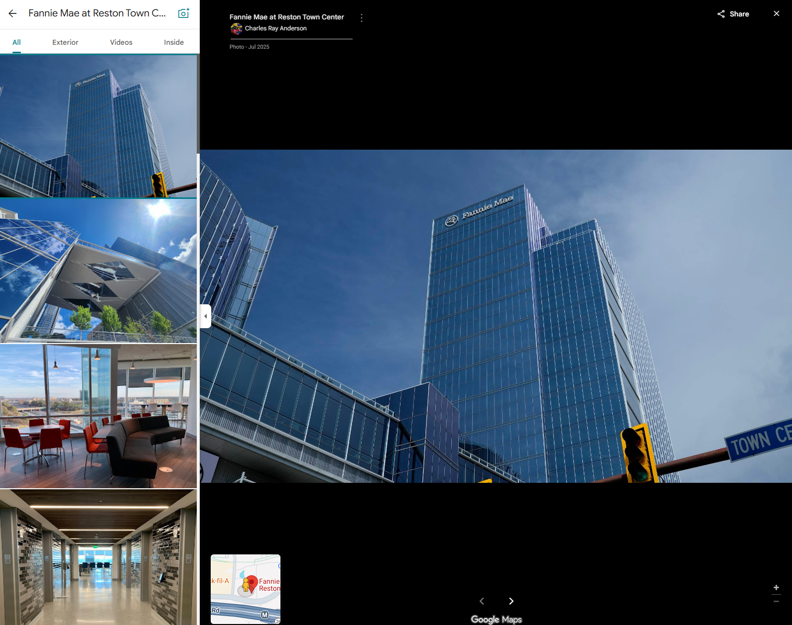
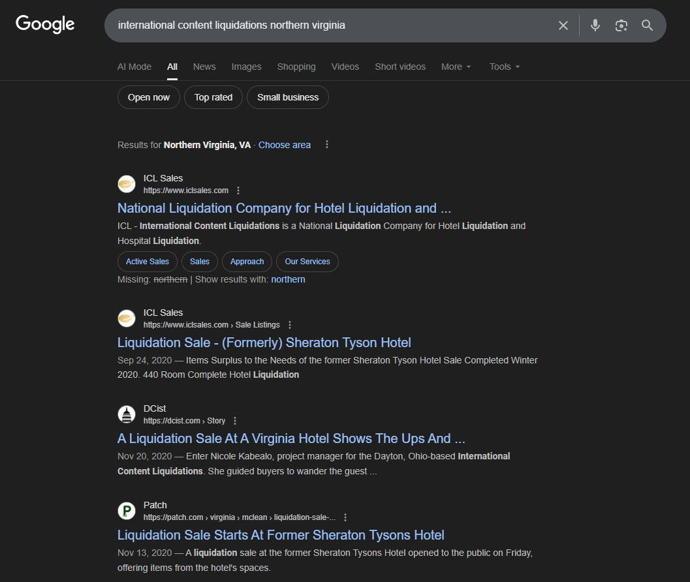
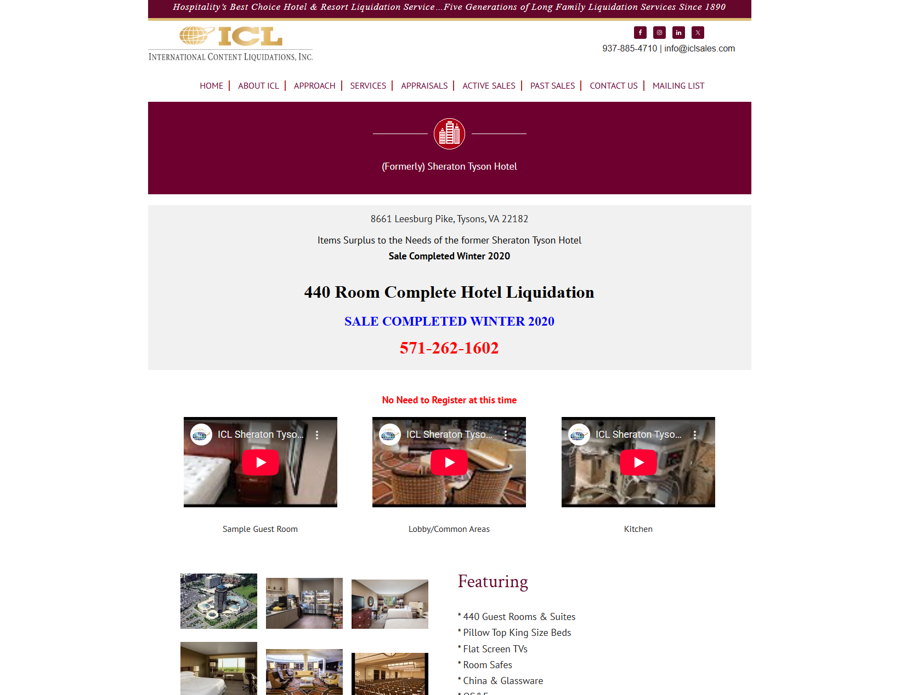
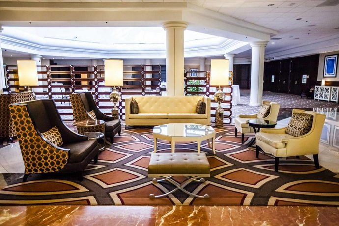

**PatriotCTF 2025**

I participated with my club team tjcsc in PatriotCTF 2025, and we got 54th overall!

**Challenge:** Waldo's Night Out

**Category:** OSINT

**Flag:** `pctf{sterling_reston_tysons}`

This challenge had three parts, where we had to find which city/town each place was in. Let's solve it step by step!

## Part 1

Here are the given images:

Interesting. These seem to be from some abandoned place. In the fourth image, there is visible text that said "Skysocks". This along with the other images reminded me of a Skyzone location. 

So, I searched up "abandoned skyzone NOVA". I immediately got these results:

They all refer to a town called "Sterling". This must be the town for the first part! Double checking my work, I went to Google Maps:

That confirms it! The first city/town must be Sterling. Currently, our flag is `pctf{sterling_}`. Let's keep going.

## Part 2

Here are the given images:

I looked through the images briefly, and noticed that it was on some rooftop of a tall building. However, what instantly gave it away was the fourth image. I instantly recognized the company to be Fannie Mae, a large government-sponsored enterprise that gives out mortgages. Doing a quick search on Google Maps gave:

There are only two locations in the Washington D.C. area, but only one of them is in Northern Virginia. It is in a town called "Reston". Sounds like the town for the second part! Let's double check:

This image looks exactly like the building from the given pictures! Now, our flag is `pctf{sterling_reston_}`. Last part, here we go!

## Part 3

Here are the given images:

Hmm, this one is a bit harder. It's some abandoned building again. The first image shows a large hallway with multiple columns. The second image shows a piece of paper that says "STOP! This area not open for liquidation", a phone number "470-277-3666", and at the bottom text that reads "ICL/International Content Liquidations, INC." My first instinct was to search up the company, which gave me these results:

Cool! I see some results for a Sheraton Tysons Hotel. That seems plausible, since the hallways look like a hotel lobby.

Clicking on the second link, I see a webpage with more details:

Maybe the images can confirm my thought. Let's look at this one:

 
This looks exactly like the first image given! I'm confident that the images are from this building.

Let's try the flag... It worked! `pctf{sterling_reston_tysons}` Nice! That was pretty easy as well.